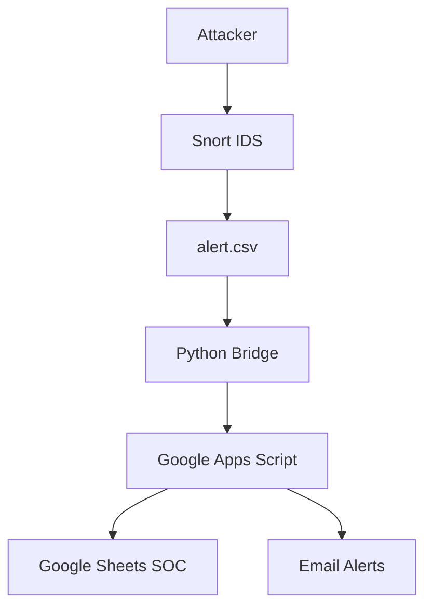

<!-- =============================== -->
<!-- 🛡️ SNORTSHEET – BEAUTIFUL README -->
<!-- =============================== -->

<p align="center">
  
</p>

<h1 align="center">🛡️ SnortSheet</h1>
<h3 align="center">The <span style="color:#00e676">Serverless SIEM</span> & <span style="color:#7c4dff">Agentic SOC Framework</span></h3>

<p align="center">
  <b>Turn Google Sheets into a Live Security Operations Center</b><br>
  Lightweight Python middleware bridging <b>Snort IDS</b> with <b>AI‑driven automation</b>
</p>

<p align="center">
  
  
  
  
</p>

<hr>

## ✨ What Makes SnortSheet Special?

<table>
<tr>
<td width="33%" align="center">⚡<br><b>Zero Infrastructure</b><br>Runs without databases, servers, or ELK</td>
<td width="33%" align="center">📊<br><b>Live SOC Dashboard</b><br>Charts, filters, timelines in Sheets</td>
<td width="33%" align="center">🤖<br><b>Agentic AI Ready</b><br>LLMs, n8n, automation friendly</td>
</tr>
</table>

---

## 🧐 About the Project

> **SnortSheet** is a security-first middleware that transforms raw network alerts into a **cloud-native SOC experience**.

It connects the battle-tested **Snort IDS** to **Google Sheets**, eliminating the need for:
- ❌ Elasticsearch
- ❌ Splunk
- ❌ MySQL
- ❌ Heavy servers

🎯 **Goal:** Make enterprise-grade monitoring accessible to **students, labs, researchers, and small teams**.

---

## 🎨 Feature Cards

<table>
<tr>
<td>

### 🔥 Intelligent Anti‑Flood Engine
- Composite-key deduplication  
- Cooldown enforcement  
- Zero alert spam  

</td>
<td>

### 📧 Real‑Time Alerts
- HTML formatted emails  
- Threat classification  
- Source & destination context  

</td>
</tr>
<tr>
<td>

### 📈 SOC Dashboard
- Attack timelines  
- Protocol breakdown  
- Threat trends  

</td>
<td>

### 🔌 Plug‑and‑Play Automation
- n8n workflows  
- LLM analysis  
- Firewall triggers  

</td>
</tr>
</table>

---

## 🚀 Agentic SOC Vision

<p align="center"><b>SnortSheet is the trigger layer of an autonomous SOC</b></p>

<table>
<tr>
<th>Threat</th>
<th>Agentic Response</th>
</tr>
<tr>
<td>False Positives</td>
<td>LLM classifies & annotates alerts</td>
</tr>
<tr>
<td>SSH Brute Force</td>
<td>Auto‑block IP via firewall</td>
</tr>
<tr>
<td>Unknown IP</td>
<td>AbuseIPDB / VirusTotal enrichment</td>
</tr>
<tr>
<td>Incident Report</td>
<td>AI‑generated SOC summary</td>
</tr>
</table>

---

## ⚙️ Architecture Overview



---

## 🔒 Security by Design

<table>
<tr>
<td>🔐 <b>One‑Way Traffic</b><br>No inbound ports exposed</td>
<td>🛡️ <b>HTTPS Only</b><br>TLS 1.2 / 1.3 encryption</td>
<td>🔑 <b>No Credentials</b><br>No Google passwords stored</td>
</tr>
</table>

---

## 🛠️ Installation (3 Phases)

### 🟢 Phase 1 — Google Backend
1. Create Google Sheet  
2. Extensions → Apps Script  
3. Paste `code.gs`  
4. Deploy as Web App (Access: Anyone)  
5. Copy Webhook URL  

### 🟡 Phase 2 — Snort Sensor
```bash
sudo apt install snort -y
```
```conf
output alert_csv: /var/log/snort/alert.csv timestamp,msg,proto,src,srcport,dst,dstport
```

### 🔵 Phase 3 — Python Bridge
```bash
pip3 install -r requirements.txt
sudo python3 snort_bridge.py
```

---

## 🧪 Testing Matrix

<table>
<tr>
<th>Test</th>
<th>Command</th>
<th>Expected</th>
</tr>
<tr>
<td>ICMP</td>
<td><code>ping sensor_ip</code></td>
<td>Email + Sheet entry</td>
</tr>
<tr>
<td>DNS</td>
<td><code>nslookup google.com</code></td>
<td>DNS alert</td>
</tr>
<tr>
<td>HTTP</td>
<td><code>curl http://example.com</code></td>
<td>Web alert</td>
</tr>
</table>

---

## 🗺️ Roadmap

- 🐳 Docker support  
- 💬 Slack / Discord alerts  
- 🌍 GeoIP heatmaps  
- ⚡ One‑click installer  
- 🤖 Fully autonomous SOC agents  

---

## 👨‍💻 Developer

<b>Sahil Thakur</b>  
Lead Developer & Security Researcher  

<i>“Security is not a product, but a process.” – Bruce Schneier</i>

---

## 📄 License

<b>Copyright (c) 2026 Sahil Thakur</b><br>
<b>ALL RIGHTS RESERVED</b>

This software is **proprietary and confidential**.

❌ No copying  
❌ No redistribution  
❌ No reverse engineering  

📧 Contact: <b>dev.sahilthakur@gmail.com</b>

<b>NO WARRANTY</b> — Provided “AS IS”.
